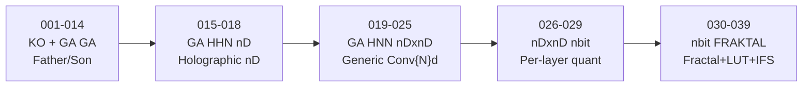

# GA HNN nDxnD — Pilnas Versijų Auditas

> [!IMPORTANT]
> Visos 28 versijos (+ 3 ZIP) yra viename kataloge: `D:\SISTEMOS\6. Varikliai Driver\7. Daddy & Sons\`
> Kitų kopijų ar nDxnD failų visame D:\SISTEMOS diske **nėra**.

---

## Evoliucijos Laiko Juosta: 5 Erų Progresas

---

## ERA 1: KO (001-014) — Father/Son + Holographic Propagation

**Failai:** `001.txt` – `014.txt` (ne-nDxnD pavadinimas)

| Savybė | Detalės |
|---|---|
| **Architektūra** | `KO_Father` + `KO_Son` — hierarchinis, du procesai |
| **HNN** | `HNN_nD_Core(n_dims)` — nD FFT holographic propagation |
| **GA** | DEAP (`cxTwoPoint`, `mutGaussian`, `selTournament`) |
| **PPO** | `stable_baselines3` sub-experiments |
| **AI Agents** | Gemini + DeepSeek + Grok consensus voting |
| **VRAM** | `pynvml` + `np.memmap` virtual memory |
| **Rolių keitimas** | Sūnus tampa tėvu, jei `fitness > parent.fitness * 1.2` |
| **Sinergija** | `shared_hologram = np.concatenate([father_holo, son_holo])` |

> [!TIP]
> **Vertinga idėja Living Silicon:** Father/Son rolių apkeitimas — analogas dabartiniam 8-lane crossover, bet su **hierarchija** (ne flat).

---

## ERA 2: GA HHN nD (015-018) — Holographic Hyper Network

**Failai:** `015 GA HHN nD.txt` (34KB), `016` (7KB), `017` (24KB), `018` (77KB)

| Savybė | Detalės |
|---|---|
| **Branduolys** | `HNN_Core` su nD complex hologram (`torch.complex64`) |
| **FFT** | `torch.fft.fftn()` — pilnas nD FFT |
| **Quantization** | LUT-based: `torch.linspace(-1, 1, 2^bits)` → phase quantization |
| **Input embedding** | Flatten → pad/truncate → reshape į `hologram_dims` |
| **Dim mutation** | GA keičia: dim dydį (×0.5..×2), prideda/ištrina dimensijas (iki 5D) |
| **VRAM saugiklis** | `max_total_elements = 256 × 256 × 2` |
| **Fitness** | `MSE_norm + VRAM_efficiency + compression + truncation_penalty` |

> [!IMPORTANT]
> **v018 (77KB) — didžiausia ir brandžiausia HHN nD versija!** Pilnas Pydantic config, structlog, YAML validacija, asyncio semaphore-controlled evaluation. Tai yra „production-grade" GA framework, tik su holographic HNN vietoj CNN.

**v018 unikalūs features (nerandami kitose versijose):**
- `Pydantic BaseModel` su `@model_validator` konfigūracijai
- `structlog` JSON + Console dual logging
- `asyncio.Semaphore` lygiagretaus evaluation throttling
- `torch.quantization.quantize_dynamic` (int8) ir `bitsandbytes.nn.Linear4bit` (4-bit)
- Recursive `nn.Sequential` quantization
- `deepcopy`-based crossover su dimensijų mismatch handling

---

## ERA 3: GA HNN nDxnD (019-025) ⭐ — Generic nD Convolution

**Failai:** `019` – `025` (47–58KB kiekvienas)

| Savybė | Detalės |
|---|---|
| **Esminis proveržis** | `Conv{N}d`, `BatchNorm{N}d`, `MaxPool{N}d` — **N iš genome** |
| **Shape tracking** | `calculate_output_dim()` — nD generalized |
| **Spatial stack** | Encoder flatten → latent → decoder Unflatten su shape stack |
| **Self-evolving fitness** | GA evoliucionuoja `fitness_weights` kaip genome dalį |
| **Fitness formulas** | 4 tipai: `linear`, `exponential`, `multiplicative`, `quadratic` |
| **Quantization** | Per-layer bit width (1-512 bits!) |

### Versijų skirtumai:
| Ver | Dydis | Esminis skirtumas |
|---|---|---|
| **019** | 48KB | Pirma nDxnD versija. `Conv{N}d` generic, nD unit-sphere params |
| **020** | 53KB | + `Pydantic`, `structlog`, `bitsandbytes`, `YAML config` |
| **021** | 53KB | Bug fixes, dimension mismatch handling |
| **022** | 51KB | Stability patches |
| **023** | 55KB | + structural mutation probability, `max_hnn_layers` limit |
| **024** | 58KB | **Brandžiausia v020 linija** — AMP (float16) training, post-training int8/4bit |
| **025** | 52KB | Simplified version |

> [!IMPORTANT]
> **v024 (58KB) yra brandžiausia nDxnD versija!** Ji turi:
> - Training-time float16 support (AMP-ready)
> - Post-training quantization (int8 + 4-bit bitsandbytes)
> - Recursive quantization per `nn.Sequential`
> - Full dimension tracking per encoder/decoder

---

## ERA 4: nDxnD nbit (026-029) — Per-Layer Quantization + Surrogate

**Failai:** `026` (26KB), `027` (52KB), `028` (74KB), `029` (32KB)

| Savybė | Detalės |
|---|---|
| **Surrogate model** | `RandomForestRegressor(n_estimators=50)` — prognozuoja fitness |
| **Niche penalty** | `euclidean distance` tarp genomų → fitness dalinamas iš `(1 + similar_count)` |
| **KMeans init** | Populiacijos inicializacija per klasterizuotus parametrus |
| **nD sphere mutation** | `genome.params` ant unit-sphere, mutacija kaip žingsnis sferos paviršiumi |
| **Stagnation detection** | `best_fitness_history` → adaptyvi mutacija |
| **Adaptive mutation** | `mutation_rate`, `mutation_strength`, `niche_radius`, `surrogate_usage` — visi evoliucionuoja |

### Versijų skirtumai:
| Ver | Dydis | Esminis skirtumas |
|---|---|---|
| **026** | 26KB | Pirma nbit versija — basic surrogate + niche |
| **027** | 52KB | + nD `calculate_output_dim`, `_adjust_output_size` |
| **028** | **74KB** | **DIDŽIAUSIAS FAILAS!** Pilnas nD+nbit+surrogate+niche. Duplikuotas HNNBuilder su dviem kopijomis (bugas?) |
| **029** | 32KB | Supaprastinta versija |

> [!WARNING]
> **v028 turi duplikuotą kodą!** Faile yra dvi `HNNBuilder` kopijos (eilutės ~500+). Tai greičiausiai merge klaida, bet abiejose kopijose yra skirtingos decoder logikos — verta patikrinti, kuri geresnė.

---

## ERA 5: nbit FRAKTAL (030-039) ⭐⭐ — Fractal Compression + CUDA IFS

**Failai:** `030` – `039` (20–36KB kiekvienas, + 3 ZIP)

| Savybė | Detalės |
|---|---|
| **Fractal encoding** | `_hierarchical_block_split()` → LUT transform → mean → quantize |
| **IFS kernel** | CUDA `@cuda.jit` + Numba `@jit(nopython=True)` CPU fallback |
| **LUT** | Sparse (`torch.sparse_coo_tensor`) arba Dense, dydis iki 1M |
| **PSNR metric** | `20 * log10(max_val / sqrt(MSE))` — vaizdo kokybės matavimas |
| **Fractal entropy** | `scipy.stats.entropy(histogram)` — signalo sudėtingumo matavimas |
| **Mandelbrot data gen** | `_generate_fractal_data()` — nD Mandelbrot set kaip test data |
| **Actuator reuse** | `fractal_actuator` — cached encoded state su reuse limit |
| **PSNR-compression tradeoff** | `dynamic_psnr_threshold = threshold - (compression/100) * tradeoff` |

### Versijų skirtumai:
| Ver | Dydis | AI autorius | Esminis skirtumas |
|---|---|---|---|
| **030** | 33KB | ? | Pirma FRAKTAL versija. `RandomForest` surrogate, `KMeans` init, nD sphere |
| **031** | 33KB | ? | Minor patches |
| **032** | 36KB | ? | + ZIP archyvas |
| **033** | 21KB | **GEMINI** ⭐ | **"Labai geras kokybės/kompresijos santykis"** — 485:1 compression, 35.2 dB PSNR, fitness 0.93. Test ataskaita viduje! |
| **034** | 29KB | ? | + ZIP archyvas |
| **035** | 20KB | ? | Supaprastinta — be `fractal_entropy` fitness weight, be `RandomForest` |
| **036** | **36KB** | **GEMINI** ⭐ | **Brandžiausia FRAKTAL versija!** `fractal_entropy_bonus`, `compression_psnr_tradeoff`, LUT matmul [latent_dim × latent_dim], Numba CPU fallback, `n_init=10` KMeans |
| **037** | 26KB | ? | Variant |
| **038** | 22KB | ? | Variant |
| **039** | 22KB | **GROK** | nD IFS kernel: `ifs_iterate_kernel_nD` su N-dim z-update, `itertools.product` nD block split, `io.BytesIO` actuator serialize, tournament selection, diversity score in fitness |

> [!IMPORTANT]
> **v033 turi test ataskaitą su realiais rezultatais:**
> - Fitness: **0.93**, PSNR: **35.2 dB**, Compression: **485:1**
> - Gen 4: GA automatiškai perėjo nuo 8-bit → 4-bit
> - Gen 8: adaptyviai padidino PSNR threshold po kokybės kritimo

---

## Unikalių Idėjų Katalogas (Tiesioginė Vertė Living Silicon)

### Jau turime Living Silicon:
| Feature | LS statusas |
|---|---|
| 8-lane GA crossover | ✅ |
| Fixed-point int16 | ✅ |
| Multi-channel fitness | ✅ |
| AVX2 SIMD | ✅ |
| PI homeostatic control | ✅ |

### Ko **neturime**, bet galime pasiskolinti:

| # | Feature | Šaltinis | Vertė |
|---|---|---|---|
| 1 | **Surrogate model** (RandomForest) | v026-029 | Prognozuoja fitness be brangaus evaluation → 10x daugiau variantų per laiką |
| 2 | **Niche penalty** (euclidean distance) | v026-029 | Neleidžia populiacijai konverguoti į vieną tašką → diversifikacija |
| 3 | **nD unit-sphere mutation** | v030+ | Parametrai ant hipersferos → stabilesnė erdvės exploration |
| 4 | **Self-evolving fitness** | v019+ | GA keičia savo tikslų svorius → adaptacija prie skirtingų režimų |
| 5 | **Hierarchical block split** | v033+ | Fractal decomposition → multi-resolution processing |
| 6 | **Father/Son role reversal** | v001 | Hierarchinė GA su dinaminiais rolės pakeitimais |
| 7 | **PSNR-compression tradeoff** | v036 | Dinaminis kokybės slenkstis pagal kompresiją |
| 8 | **Stagnation detection** | v030+ | Auto-boost mutation kai evoliucija užstringa |
| 9 | **nD IFS kernel** (CUDA) | v039 | N-dim fractal iteration GPU |
| 10 | **LUT transform** (sparse/dense) | v033+ | Lookup table kaip encode/decode mechanizmas |

---

## Atskirtos Vertingiausios Versijos (Top 5)

| Rangas | Versija | Kodėl vertinga |
|---|---|---|
| 🥇 | **v024** (58KB) | Brandžiausia nDxnD — AMP, int8+4bit, full dim tracking |
| 🥈 | **v036** (36KB) | Brandžiausia FRAKTAL — fractal entropy, PSNR tradeoff, Numba fallback |
| 🥉 | **v033** (21KB) | **Testuota! 485:1 compression, 0.93 fitness** — proof that architecture works |
| 4 | **v039** (22KB) | Unikalus nD IFS kernel, tournament selection, diversity score |
| 5 | **v018** (77KB) | Brandžiausia HHN nD — production-grade framework (Pydantic, structlog, async) |

---

## Codex Užduotys

- [ ] **v028 duplikato tyrimas** — ar antras HNNBuilder turi geresnę decoder logiką?
- [ ] **v033 test rezultatų validacija** — ar 485:1 ratio yra realistiškas, ar simuliacinis artefaktas?
- [ ] **Surrogate model feasibility** — ar RandomForest analogas telpa į Living Silicon L1 cache budget?
- [ ] **nD unit-sphere mutation C++ port** — trivialus: `std::normal_distribution` + normalize
